# Chintan Dave
## 💼 Relationship Manager | Business Banking | SME & Corporate Specialist

**Financial Consultant** @ ICICI Bank UK PLC | 5.5+ Years | £5B Portfolio

---

## 📊 Portfolio Performance Dashboard

<table align="center">
<tr>
<td align="center"><b>Portfolio Value</b> <h2>£5B+</h2></td>
<td align="center"><b>Active Clients</b> <h2>65+</h2></td>
<td align="center"><b>Wallet Growth</b> <h2>12% ↑</h2></td>
<td align="center"><b>Retention</b> <h2>95%+</h2></td>
</tr>
<tr>
<td align="center"><b>Cross-sell Ratio</b> <h2>3.2x</h2></td>
<td align="center"><b>New Referrals</b> <h2>15+</h2></td>
<td align="center"><b>Compliance</b> <h2>100%</h2></td>
<td align="center"><b>NPS Score</b> <h2>85+</h2></td>
</tr>
</table>

---

## 🎯 Core Competencies Distribution

---

## 📈 Career Growth Timeline

```mermaid
%%{init: {'theme':'dark', 'themeVariables': { 'primaryColor':'#1e40af'}}}%%
timeline
    title Professional Journey
    2016-2018 : Vendor Management : Course5i : Project Coordination
    2018-2021 : Deputy Manager II : ICICI Bank India : £5M+ Portfolio : NRI & Elite Clients
    2021-2023 : Manager : Kotak Mahindra : £5M+ SME Portfolio : 30% Revenue Growth
    2025-Present : Financial Consultant : ICICI Bank UK : £5B Portfolio : 65+ Clients
```

---

## 💡 Business Impact Metrics

**📊 Legend:** Bar = Revenue Growth | Line = Client Retention

---

## 🏆 Key Achievements

<table>
<tr>
<td width="50%">

### 💰 Revenue Excellence
- **30%** ↑ Repeat Business
- **18%** ↑ Cross-sell Revenue
- **25%** ↑ Profit Margins (FX)
- **15%** Better FX Rates vs Market

</td>
<td width="50%">

### 🤝 Client Success
- **20%** ↑ Retention Rate
- **25%** ↑ Satisfaction Scores
- **25+** New Clients/Year
- **15+** Referrals Generated

</td>
</tr>
</table>

---

## 🔧 Technical Stack

### Banking & Financial Systems

### Analytics & Reporting

### Compliance & Risk

---

## 🎓 Certifications

| 🎖️ Certification | Issuer | Status |
|:-----------------|:-------|:------:|
| **AMFI** | Association of Mutual Funds (India) | ✅ |
| **IRDAI** | Insurance Regulatory Authority (India) | ✅ |
| **Bloomberg Terminal** | Bloomberg | ✅ |
| **Trade Finance** | Industry Standard | ✅ |

---

## 🚀 Featured Project

### 📊 [SME Portfolio Analysis Dashboard](https://github.com/chintandaveaimsr-maker/sme-portfolio-analysis)

**Tech:** `Python` `Pandas` `Plotly` `Financial Modeling`

**Impact:** 65% cross-sell conversion | Automated risk scoring | Real-time compliance

---

## 📊 GitHub Analytics

---

## 🌍 Professional Network

---

## 📞 Connect With Me

**🗣️ Languages:** English (Fluent) | Hindi (Native) | Gujarati (Native)  
**📍 Location:** London, UK | **🌐 Status:** Authorized to work in UK

---

## 🏆 GitHub Trophies

---

## 📈 Contribution Activity

---

### 💼 Open to opportunities in Relationship Management | Business Banking | Portfolio Analytics | Fintech

**"Building sustainable client relationships through data-driven solutions and service excellence"**

*Last Updated: February 2026*

